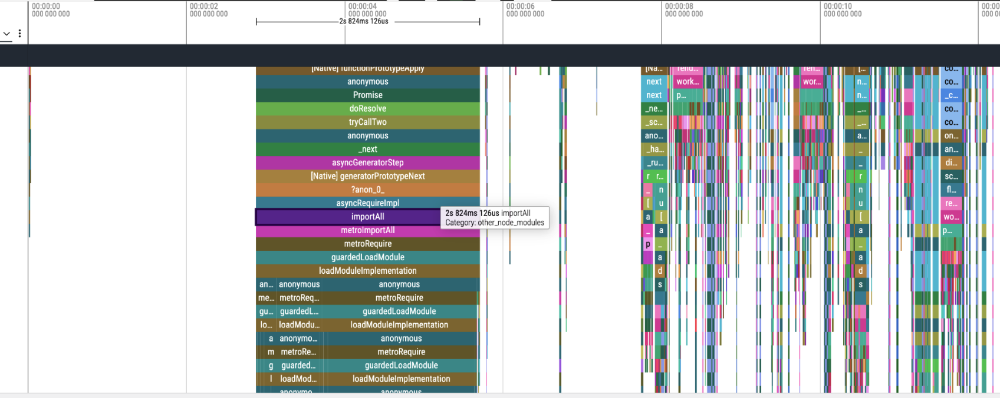

A Hermes CPU profile of our Android app's cold start had a single block of `metroRequire` calls running for **2.8 seconds**.

Every frame in that flamegraph is the same call stack: `importAll → metroRequireImpl → guardedLoadModule → loadModuleImplementation`. The JS runtime evaluating every `require()` it encounters — eagerly, synchronously, at startup.

This kicked off three threads of work:

1. **How do inlined requires actually work?** The flag is supposed to defer module evaluation. We turned it on and the profile barely moved.
2. **Why didn't it help?** There's a structural class of modules the transform cannot defer, and we were full of them.
3. **Does Expo Router solve this automatically?** File-based routing promises lazy screens by default. We verified the mechanism.

The series:

- [Exploring Inlined Requires: How They Really Work](/posts/2026-06-02-how-metro-inlined-requires-work/) — what the transform does to the bundle, what Expo does differently, and what rnx-kit's esbuild path actually changes.
- [Exploring Inlined Requires: When Flipping the Flag Does Nothing](/posts/2026-06-03-inlined-requires-eager-aggregators/) — the war story, eager aggregators, and the structural fix.
- [Exploring Inlined Requires: Does Expo Router Give You Screen-Level Lazy Loading?](/posts/2026-06-04-expo-router-screen-level-lazy-loading/) — yes, and here's the exact mechanism.
