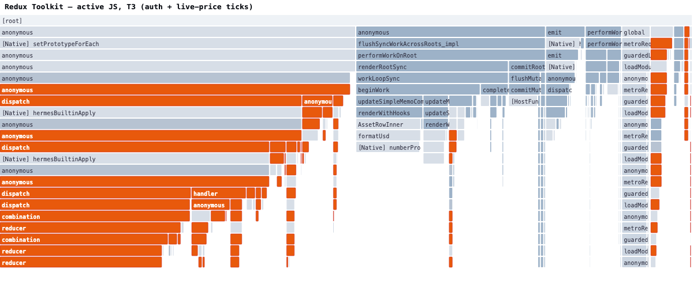
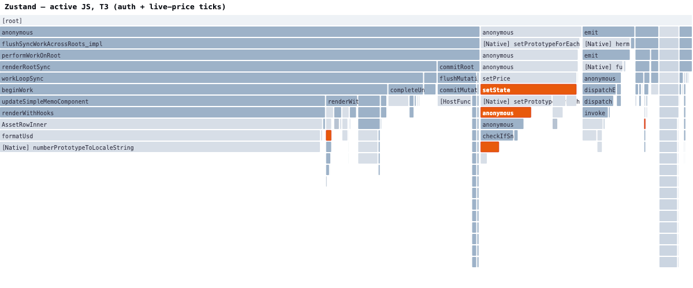

Every React Native app that talks to a server has to decide *how* it holds that
server state. You can reach for a full-fledged normalizing client —
[Relay](https://relay.dev/), [TanStack Query](https://tanstack.com/query),
[RTK Query](https://redux-toolkit.js.org/rtk-query/overview) — or you can keep it
barebones with a plain `fetch` and [Zustand](https://github.com/pmndrs/zustand) /
[Jotai](https://jotai.org/) / hand-rolled module state.

The features those big clients offer are real: normalized caches, automatic
refetching and invalidation, structural sharing, query deduplication, observer
graphs, optimistic updates. The question I wanted a number for is:

> **What do those features cost per network request in client-side CPU, and is
> that cost worth it on a low-end device?**

So I built one app, six times over, and measured it. Everything here is
reproducible —
[**AndreiCalazans/GraphqlClientComparison**](https://github.com/AndreiCalazans/GraphqlClientComparison).

## The test harness

One Expo (SDK 57 / RN 0.86 / React 19, New Architecture) app that renders a
Coinbase-style **markets** screen against Coinbase's **public GraphQL API**
(`graphql.coinbase.com`). It contains **all six data layers behind one shared
`DataLayer` contract**; the active one is chosen at cold start by a deep link
(`gqlharness://home?variant=rtk`). The UI is written *only* against that
contract, so it is **byte-for-byte identical** across variants — the only thing
that changes is the machinery behind the hooks. That's what makes the delta the
*library's* cost and not the UI's.

What the app actually does (here's the full T3 flow — sign in, balance,
watchlist add/remove, live-ticking prices, asset detail with description /
market cap / volume):

<video controls muted playsinline loop preload="metadata" style="max-width: 300px; width: 100%; display: block; margin: 0 auto;">
<source src="/videos/gql-client-demo.mp4" type="video/mp4" />
</video>

*One binary, driven by Maestro. This run is the TanStack Query variant. The green `profiler-done` pill in the corner is the button the flow taps to stop the Hermes profiler — more on that below.*

- **Real data.** Home renders five sections (Watchlist, Top gainers, Top losers,
  Top movers, Recently listed), each four assets, via `searchAssetsV2` +
  `assetBySymbol`. Asset detail pulls description, market cap, 24h volume + change,
  and multi-window price changes. **Live prices stream from the Coinbase exchange
  WebSocket** (ticker channel), coalesced to a 250 ms flush — the same transport
  for every variant.
- **Six variants, latest versions:** Relay 21, TanStack Query 5.101, RTK 2.12
  (RTK Query), Zustand 5.0, Jotai 2.20, and a **vanilla** baseline (module state
  + `useSyncExternalStore`, no library).
- **Fair by construction.** Every variant uses the *same* `fetch` + parsing and
  the *same* WebSocket. They differ only in how they cache, subscribe, and
  re-render around that data.
- **Device:** a physical **Samsung Galaxy A16 (SM-A165M)** — a genuinely low-end
  phone, which is the whole point. Release build, Hermes.
- **[Maestro](https://maestro.mobile.dev/)** drives three e2e flows so runs are
  identical: **T1** open → tap a top gainer → detail → back; **T2** scroll to the
  bottom → open the last asset; **T3** sign in → open a top loser → add to
  watchlist → back → reopen → unwatch → back (the long one, ~80 s, with the most
  live-price ticks).

### How the JS-CPU numbers were captured

Two independent instruments:

- **[Flashlight](https://github.com/bamlab/flashlight)** for FPS, RAM, and
  per-thread CPU (the `mqt_v_js` JS thread), median of 3 iterations per flow.
- The **Hermes sampling profiler**, enabled in `MainApplication.onCreate` (via an
  Expo config plugin) so it samples **from the first bundle module load** — early
  init and first render are in the trace, not just steady state.

One thing worth calling out because it changed the results: the profiler used to
stop on a fixed 20 s timeout, which **truncated the ~80 s T3 flow** and threw
away most of its samples — exactly the samples where the live-price ticks hit the
store. I replaced it with an on-screen **stop button the Maestro flow taps at the
end of each test**; the flow then asserts a `profiler-done` marker that only
appears *after* the `.cpuprofile` is written, so the host always pulls a complete
file. After that fix the measured library CPU roughly **doubled** and the T3
per-tick cost finally showed up. Measure the whole window, or don't bother.

## The bill: JS-thread CPU spent *inside the library*

The cleanest number is **library self-time**: source-map the Hermes trace, then
sum the time actually executing inside each library's own `node_module`s (idle /
network wait excluded). Summed across all three flows:

| Variant | library self-time | vs vanilla | what runs |
| --- | ---: | ---: | --- |
| **Vanilla JS** | **0 ms** | — | nothing — plain `fetch` + `useSyncExternalStore` |
| **Jotai** | 122 ms | +122 | atom read/write |
| **Zustand** | 277 ms | +277 | `setState` + selector notify |
| **Relay** | 804 ms | +804 | response normalization into the record store |
| **TanStack Query** | 904 ms | +904 | observer + structural sharing (`replaceEqualDeep`) |
| **Redux Toolkit** | **3218 ms** | **+3218** | Immer `produce` + reducer + `reselect`, per dispatch |

Two tiers fall out immediately:

- **Barebones (Vanilla / Jotai / Zustand):** essentially free. Jotai and Zustand
  give you real ergonomics for a few hundred milliseconds across the *entire*
  test suite — noise, in practice.
- **Full server-state clients (Relay / TanStack / RTK):** a real, measurable
  cost. Relay and TanStack are in the same ballpark (~0.8–0.9 s). **RTK Query is
  3–4× heavier than either**, and ~26× the barebones stores.

### The cost concentrates on writes — i.e. per request *and* per tick

Break the same self-time down by test and the shape of the cost appears. **T3**
is the longest flow and the one with the most **live-price WebSocket ticks**
flowing through the store:

| Variant | T1 | T2 | T3 (auth + live ticks) |
| --- | ---: | ---: | ---: |
| Vanilla JS | 0 | 0 | 0 |
| Jotai | 50 | 35 | 37 |
| Zustand | 72 | 36 | 169 |
| Relay | 202 | 120 | 482 |
| TanStack Query | 320 | 90 | 494 |
| Redux Toolkit | 697 | 587 | **1934** |

RTK's cost *explodes* in T3, because its price updates go through the full Redux
pipeline on **every single tick**. That's the key insight about server-state
clients: **the cost is per cache write.** A network response is a write. A live
tick is a write. An optimistic update is a write. The more the library does to
keep its cache correct and its observers consistent, the more each write costs —
and if you route a high-frequency stream through it, you pay that toll continuously.

## What that looks like on the JS thread

Here's the actual Hermes flamegraph of the **active JS work** during T3 (idle /
network wait removed) for RTK Query. Orange is Redux/Immer/reselect; blue-grey is
React rendering:

Look at the left third: stacks of `dispatch → combination → reducer` (Redux) and
Immer's copy-on-write `produce`, repeating for each update, sitting right next to
React's `renderWithHooks` / `AssetRowInner`. Every one of those orange towers is
a live-price tick being folded into the store.

Now the **same flow, same device, Zustand**:

A live tick is a single `setState` — one thin orange sliver. The rest is React
doing the render it would have done anyway. That visual *is* the difference
between "server-state client" and "state primitive."

## FPS and RAM — and why "60 FPS" is a trap here

Across all six variants: **~60 FPS, and RAM within a ~7 MB band (254–261 MB).**
Frame rate did not separate the libraries at all.

> **Do not read that as "the data layer is free."** This harness is deliberately
> *lightweight* — its JS thread is mostly idle, waiting on the network. Even the
> heaviest client has plenty of headroom, so frames still land on time. In a
> **real, busy app** — many mounted screens, analytics, a deep component tree,
> feature providers, animations, and high-frequency data all sharing the single
> JS thread — that headroom is gone. There, the extra JS-CPU a heavy client burns
> *on every write* competes directly with rendering and gesture handling: the
> thread saturates, `requestAnimationFrame` callbacks and touches queue up behind
> it, and the app feels janky and unresponsive — even though a micro-demo like
> this one still reports "60 FPS." **JS-CPU is the metric that predicts real-world
> responsiveness**, precisely because it's the resource that runs out first under
> load. FPS only looks flat here because nothing else is contending for the thread.

## So what are you actually paying for?

The full-fledged clients aren't expensive by accident — the cost *is* the
feature. What you buy for that JS-CPU:

- **Relay** (~0.8 s): a **normalized graph cache**. Every asset is a single record
  keyed by id; a price update to `BTC` in one query updates it everywhere `BTC`
  is rendered, for free. You pay normalization on every response. If your app has
  the same entity on many screens and you want guaranteed consistency, this is
  the point of Relay — and its per-request cost is very reasonable for what it
  does. (Its ergonomics/compiler cost is a separate, build-time story.)
- **TanStack Query** (~0.9 s): **caching, dedup, background refetch, and
  `staleTime`/`gcTime` lifecycle** without prescribing a store shape. The recurring
  cost is `structuralSharing` (`replaceEqualDeep`) diffing each response so
  unchanged references stay stable + observer notification. A great default when
  you want server-cache semantics but not normalization.
- **RTK Query** (~3.2 s): the same query/cache features **plus** everything living
  in one Redux store with Immer + reselect. That uniformity is genuinely valuable
  if your whole app is already Redux — but the Immer-`produce`-per-dispatch tax is
  the highest of the three, and it recurs on **every** write. On a low-end device,
  it's the one to watch.
- **Zustand / Jotai** (~0.1–0.3 s): not server-state clients at all — they're
  state *primitives*. You get no cache lifecycle, no dedup, no normalization; you
  wire fetching yourself. In return you pay almost nothing per update.

### Practical guidance

1. **Match the tool to the shape of your data, not to fashion.** Same entity on
   many screens with strong consistency needs → Relay. Server-cache semantics
   without normalization → TanStack. Already all-in on Redux → RTK, eyes open.
   Simple screens / you'll wire fetching yourself → Zustand or Jotai.
2. **Keep high-frequency data out of the heavy store.** This is the big one. Live
   prices, cursor positions, scroll offsets, anything ticking many times a second
   — route those through a minimal `useSyncExternalStore`-style channel, *not*
   through Immer/reselect (RTK) or deep structural sharing (TanStack). You can use
   a full client for the slow-moving, cacheable data and a thin store for the
   firehose. In this harness that single decision is the difference between 1934 ms
   and ~40 ms of library CPU in T3.
3. **On low-end Android, a full server-state client is affordable *if* your write
   frequency is modest.** A few requests per screen: fine. A stream of ticks
   folded into a normalizing/Immer cache: not fine.

## Bottom line

The barebones stack (vanilla, Zustand, Jotai) is effectively free per request —
but you build the caching, dedup, and invalidation yourself. Relay and TanStack
Query charge a modest, mostly-per-write CPU fee for real server-cache features
that are worth it when your data shape needs them. RTK Query gives you those
features inside a uniform Redux world at 3–4× the per-write cost — the one to be
deliberate about on a low-end device, especially if live data flows through it.

None of them will cost you frames in a demo. All of them will, in a busy app, if
you route a firehose through them. Pick for the *features you need*, then keep the
*hot data* out of the expensive path.

Full harness, all six variants, the Maestro flows, the Hermes profiles, the
Flashlight JSON, and every raw number are in the repo:
[**AndreiCalazans/GraphqlClientComparison**](https://github.com/AndreiCalazans/GraphqlClientComparison).
