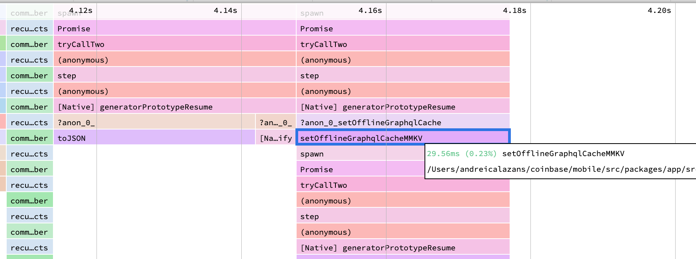
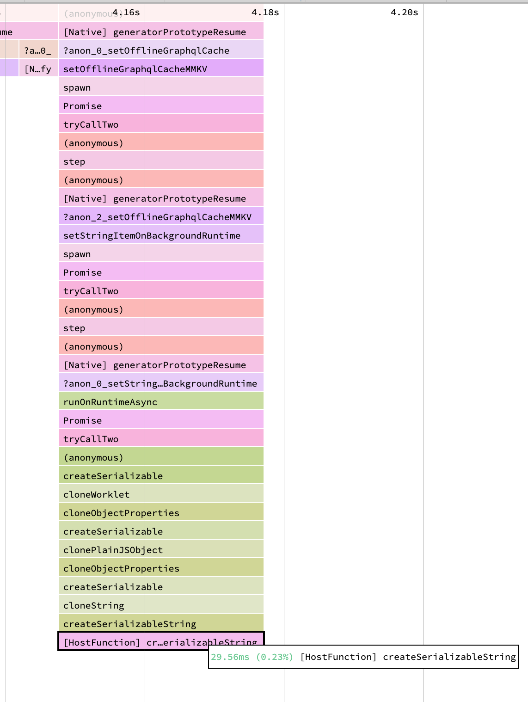
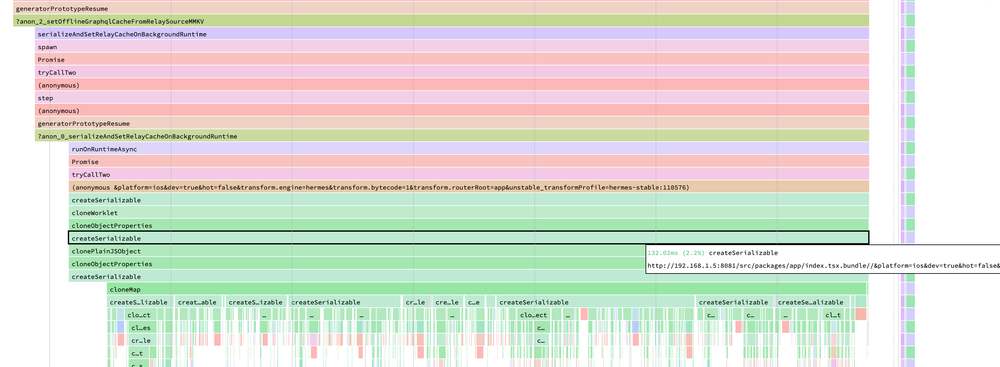
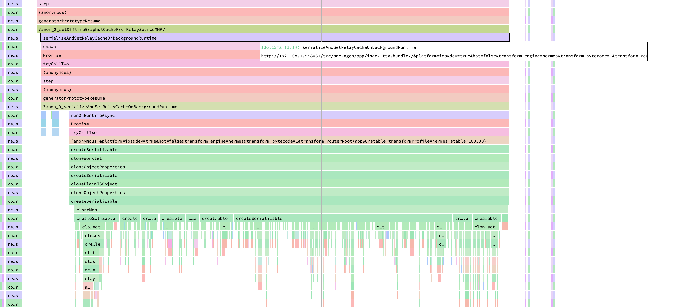

We use [MMKV](https://github.com/mrousavy/react-native-mmkv) for persistence. We
save our GraphQL store to disk so the app can start with data. This save is a
synchronous write. It runs on the JS thread. It blocks the JS thread.

We needed an asynchronous solution. We wanted the write to run off the JS thread.

A background worklet looked like the answer. But it was not. The cost to
serialize the data into the worklet was too high. This post shows the
experiment.

## The Problem

The save does two expensive steps on the JS thread:

1. It turns the GraphQL store into a plain object (`toJSON`) and makes it a
   string (`JSON.stringify`).
2. It writes that string to MMKV (`setOfflineGraphqlCacheMMKV`).

The next trace shows both steps. The MMKV write alone (`setOfflineGraphqlCacheMMKV`)
costs about **29.56ms**. The `toJSON` step runs before it. All of this work
blocks the JS thread.



This is a problem. When the JS thread is busy, the app cannot respond to the
user. Gestures and animations drop frames.

## The Idea: Move the Write to a Worklet

[MMKV is now built on Nitro Modules](https://github.com/mrousavy/react-native-mmkv/issues/446#issuecomment-4099551180).
Marc Rousavy, the author of MMKV, recommends a simple pattern. You can use MMKV
inside a worklet. A worklet runs on a different thread. So you can move the write
off the JS thread:

```typescript
const storage = createMMKV()
const runtime = createWorkletRuntime({ name: 'background' })
const result = await runOnRuntimeAsync(runtime, () => {
  'worklet'
  storage.set('heavy-key', 'heavy value goes here')
  return storage.getString('heavy-key')
})
```

This looks good. But there is a cost. A worklet runs in a different runtime. The
data you send to the worklet must be copied into that runtime. This copy is the
**serialization cost**. It is not free.

We did three experiments to measure this cost.

## Experiment 1: Move Only the MMKV Write

First, we moved only the MMKV write into the worklet. The `toJSON` and
`JSON.stringify` steps stayed on the JS thread. We sent the final string to the
worklet. The worklet wrote the string to MMKV.

The result was bad. The new call (`setStringItemOnBackgroundRuntime`) was as slow
as the original write. The reason is at the bottom of the trace:
`createSerializableString`. This step copies the string into the worklet runtime.
It costs about **29.56ms** — the same as the whole original write.



So we did not save time. We only moved the cost. The write became cheap in the
worklet, but the copy of the string into the worklet cost the same amount. This
is a no-go.

## Experiment 2: Move the Whole Object to the Worklet

The first experiment sent a string. But we also pay to make that string on the
JS thread (`toJSON` and `JSON.stringify`). So we had a new idea. We thought: if
we must pay the serialization cost, then move **all** the work into the worklet.

We sent the raw store object to the worklet. The worklet does everything:

1. It turns the store into a plain object (`toJSON`).
2. It filters the records.
3. It makes the string (`JSON.stringify`).
4. It writes to MMKV.

We hoped the JS thread would only pay a small cost to send the object. But this
was not true. The result was **worse**.



The trace shows why. The object is large. The worklet must copy every property.
You can see `cloneMap`, `cloneObjectProperties`, `clonePlainJSObject`, and many
`createSerializable` calls. The copy runs one property at a time. This
`createSerializable` work costs about **132ms** on the JS thread.

So we made it worse. A large object is very expensive to copy into a worklet. The
copy cost is higher than the cost we tried to remove.

## Experiment 3: Turn On Bundle Mode

We had one more thing to try. Our app did not use worklets **Bundle Mode**.
[Bundle Mode](https://docs.swmansion.com/react-native-worklets/docs/category/bundle-mode)
changes how worklets are built. It ships worklets as normal bundled
modules. We wanted to be sure Bundle Mode did not change the serialization cost.

So we turned Bundle Mode on. We ran the same experiment again.



The result was the same. The copy cost was about **136ms**. Bundle Mode does not
change the serialization cost. Bundle Mode changes how worklet code is built. It
does not change how worklet data is copied.

This makes sense. The serialization cost comes from the data, not the code. A
large object is large in both modes. The copy must still visit every property.

## The Learning

A worklet is not a free way to move work off the JS thread. When you send data to
a worklet, you pay to copy that data into the worklet runtime. This is the
serialization cost.

The serialization cost is high for large data:

- For a **string**, the copy cost is about equal to the write cost. You do not
  save time.
- For a **large object**, the copy cost is very high. You lose time. Every
  property is cloned one by one.
- **Bundle Mode** does not change this. The cost comes from the data.

So we did not move the MMKV write to a worklet. The serialization cost made it a
no-go.

Before you move an expensive step to a background worklet, measure the
serialization cost first. Send small data if you can. If you must send large
data, the copy can cost more than the work you move.
