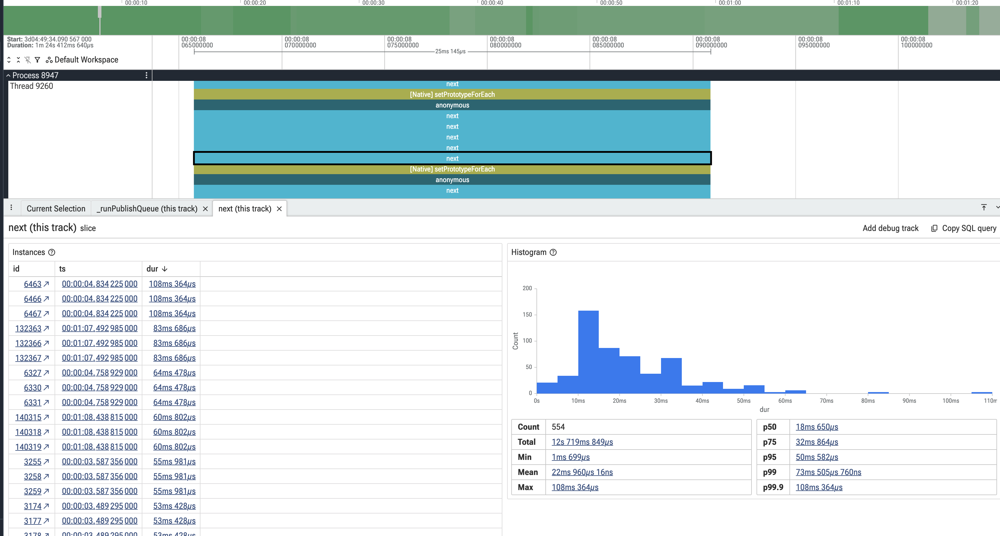

Relay is a great tool. But you should not put all your data in it. Some data
gets no benefit from the normalized store, and you still pay the full cost.

## 1. What Relay Solves

Relay gives you a normalized client-side cache. When a GraphQL response comes
back, Relay stores each entity by a global id. If the same entity appears in
two different queries, Relay keeps one copy. When that entity changes, every
screen that reads it updates.

You do not think about how to store the data. You do not write reducers. You
do not sync one screen with another. You read a fragment and Relay does the
rest. For genuine entities — a user, an asset, a portfolio — this is exactly
what you want.

## 2. The Cost of Relay

The normalized store is not free. You pay twice.

_Can you imagine paying 12 seconds in a 50 seconds window to just data
normalization plus subscription?_

- **Normalization CPU.** Every response is normalized into the record map.
  Every store read runs referential-equality maintenance that scales with the
  store size. The bigger the store, the more work per read.
- **Persistence CPU.** To persist the offline cache, Relay must
  `JSON.stringify` the whole record map and deep-copy every record.

I have seen a Relay store grow to ~18 MB in memory from unchecked usage — teams
just kept adding fragments and never asked what belonged in the store. The
default, naive persistence solution then pays a hefty price. It must
`stringify` this whole blob and deep-copy every record to write it to disk, on
every persist. Both costs scale with the store size. A bigger store taxes every
read and every write.

## 3. What Does Not Benefit From the Normalized Store

Here is the key point: much of the store gets **no** benefit from
normalization, but pays the full price.

In that ~18 MB store, the large majority, by bytes, was data that is never
cross-referenced and is read as a whole:

- **Client config** — keyed by query argument, read as one map.
- **Experiments** — index-based ids that churn on every refetch, read-only.
- **Volatile market data** — price series and FX quotes, high-churn
  time-series read as arrays.
- **Server-driven UI** — render trees keyed by surface query, read as a whole.
- **Inlined assets** — Lottie JSON stored as strings inside a text field.

For this data, normalization invents synthetic id keys that are often larger
than the values they point at. In these snapshots, **16–29%** of the whole
store was nothing but synthetic id strings.

None of this needs cross-query consistency. None of it is updated in place.
There is no shared entity to keep in sync. It is a document cache pretending
to be a normalized graph.

## The Rule

Keep genuine entities in Relay — viewer, assets, portfolio, anything you
cross-reference and update in place. That is where normalization pays off.

Move read-mostly, no-overlap data out. A plain store (for example Zustand) with
its own fetch, refresh, and persist policy is strictly cheaper. You store the
JSON as-is and read it with a getter. No normalize pass. No whole-store
`stringify`.

Not every query needs a normalized cache. Use Relay where it earns its cost,
and not where it does not.
