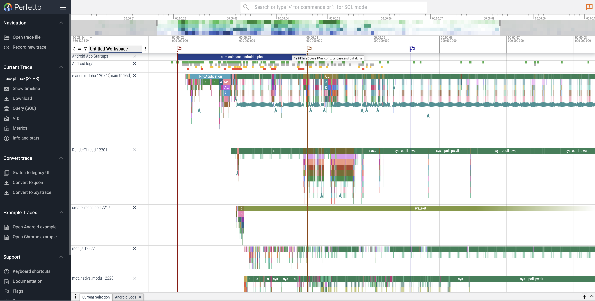

If you have built a big enough React Native app you will eventually find
yourself asking why is your app slow to start on Android.

> Haters will likely say
that it's React Native's fault.

I disagree. I think this is actually caused by
the type of Software Engineer working on React Native Apps. They rarely have a
mobile first background which often causes features to be introduced without
consideration for app startup performance.


By default React
Native Android app is as fast as a native app since it is a native app. Given
that nothing should stop you from building a fast app. I usually tell folks that
if we can measure we can improve it.

So how do you check measure app start performance in a React Native Android app?

## Using Perfetto

Perfetto is a tool for tracing and profiling Android apps. It can capture
detailed performance data, including app start times, CPU usage, memory
allocation, and more. This makes it an excellent choice for analyzing app start.

However, it's abudance of features makes it actually hard to know how to get
started.

For that reason here is a script that can help you get started.


## What Can You Check In Perfetto?

Before showing how to do it, let me just highlight what you can get from this.


I suggest you check the following proccesses in the trace:

- main thread: You can see how long it took to initialize the app plus all the
  Choreagrapher calls to dispatch rendering tasks.
- mtq_js: This is the JavaScript thread, where the JavaScript code
  runs. You can check how long it takes to execute the initial JavaScript code
  and any delays in processing.
- mqt_native_modu: This is the native module thread, where the native
  modules are executed. You can check how long it takes to execute the initial
  native modules and any delays in processing.
- create_react_co: This is a thread used to initialize the React Native context.
  You can see how long it is taking to process React Native packages.
- createView: This event captures how many createView calls were made which can
  show you how early the first view triggered from React Native was called plus
  how many views were made.

With the above you should be able to identify what happened before the JS thread
was initialized. Why did it take so long. What kind of tasks are impacting each
thread and more.

The trace has a whole lot more information and this is just scratching the
surface.

Now how do we capture this trace?

## Capturing a Perfetto Trace

To view Systrace calls from react-native and your app's processess you must add
profileable attribute to your AndroidManifest.xml file:

```xml
  <profileable android:shell="true" />
```

You can then build your app in release mode. This is important because you want
to capture a real user experience, not a debug one.


Once done. Copy the following script to a file called `capture_systrace.sh`
locally.

```shellscript

#!/bin/bash

set -e

print_help() {
  echo "Usage: capture_systrace APP_ID [output_filename.pftrace]"
  echo
  echo "Starts a Perfetto systrace for the given APP_ID on a connected Android device."
  echo
  echo "Arguments:"
  echo "  APP_ID               The application ID to trace (e.g. com.example.myapp)"
  echo "  output_filename      Optional output filename (default: trace.pftrace)"
  echo
  echo "Options:"
  echo "  -h, --help           Show this help message and exit"
}

# Show help if requested
if [[ "$1" == "--help" || "$1" == "-h" ]]; then
  print_help
  exit 0
fi

# Validate input
if [ -z "$1" ]; then
  echo "Error: APP_ID is required."
  print_help
  exit 1
fi

APP_ID="$1"
OUTPUT_FILE="${2:-trace.pftrace}"
REMOTE_PATH="/data/misc/perfetto-traces/trace.pftrace"

CONFIG=$(cat <<EOF
buffers {
  size_kb: 131072
  fill_policy: DISCARD
}
data_sources {
  config {
    name: "linux.ftrace"
    ftrace_config {
      ftrace_events: "sched/sched_process_exit"
      ftrace_events: "sched/sched_process_free"
      ftrace_events: "task/task_newtask"
      ftrace_events: "task/task_rename"
      ftrace_events: "sched/sched_switch"
      ftrace_events: "power/suspend_resume"
      ftrace_events: "sched/sched_blocked_reason"
      ftrace_events: "sched/sched_wakeup"
      ftrace_events: "sched/sched_wakeup_new"
      ftrace_events: "sched/sched_waking"
      ftrace_events: "sched/sched_process_exit"
      ftrace_events: "sched/sched_process_free"
      ftrace_events: "task/task_newtask"
      ftrace_events: "task/task_rename"
      ftrace_events: "power/cpu_frequency"
      ftrace_events: "power/cpu_idle"
      ftrace_events: "power/suspend_resume"
      ftrace_events: "raw_syscalls/sys_enter"
      ftrace_events: "raw_syscalls/sys_exit"
      ftrace_events: "ftrace/print"
      atrace_categories: "adb"
      atrace_categories: "aidl"
      atrace_categories: "am"
      atrace_categories: "audio"
      atrace_categories: "binder_driver"
      atrace_categories: "binder_lock"
      atrace_categories: "bionic"
      atrace_categories: "camera"
      atrace_categories: "dalvik"
      atrace_categories: "database"
      atrace_categories: "gfx"
      atrace_categories: "hal"
      atrace_categories: "input"
      atrace_categories: "network"
      atrace_categories: "nnapi"
      atrace_categories: "pm"
      atrace_categories: "power"
      atrace_categories: "res"
      atrace_categories: "rro"
      atrace_categories: "rs"
      atrace_categories: "sm"
      atrace_categories: "ss"
      atrace_categories: "vibrator"
      atrace_categories: "video"
      atrace_categories: "view"
      atrace_categories: "webview"
      atrace_categories: "wm"
      symbolize_ksyms: true
      disable_generic_events: true
      atrace_apps: "$APP_ID"
    }
  }
}
data_sources {
  config {
    name: "linux.process_stats"
    process_stats_config {
      scan_all_processes_on_start: true
    }
  }
}
data_sources {
  config {
    name: "linux.sys_stats"
    sys_stats_config {
      stat_period_ms: 250
      stat_counters: STAT_CPU_TIMES
      stat_counters: STAT_FORK_COUNT
      cpufreq_period_ms: 250
    }
  }
}
data_sources {
  config {
    name: "android.log"
    android_log_config {
      log_ids: LID_DEFAULT
      log_ids: LID_STATS
      log_ids: LID_SYSTEM
    }
  }
}
data_sources {
  config {
    name: "android.surfaceflinger.frametimeline"
  }
}
duration_ms: 10000
EOF
)

echo "Starting Perfetto trace for app: $APP_ID..."
echo "$CONFIG" | adb shell perfetto -c - --txt -o "$REMOTE_PATH"

echo "Pulling trace to ./$OUTPUT_FILE"
adb pull "$REMOTE_PATH" "$OUTPUT_FILE"

echo "Trace saved to $OUTPUT_FILE"

```


The help output explains how to use.

```shellscript

~/ ./capture_systrace.sh --help                                                                                                    17ms
Usage: capture_systrace APP_ID [output_filename.pftrace]

Starts a Perfetto systrace for the given APP_ID on a connected Android device.

Arguments:
  APP_ID               The application ID to trace (e.g. com.example.myapp)
  output_filename      Optional output filename (default: trace.pftrace)

Options:
  -h, --help           Show this help message and exit
```

By running `./capture_systrace.sh com.example.myapp`, you can capture a Perfetto
trace for your React Native app. The trace will be saved as `trace.pftrace` in
the current directory.

Tips:

1. Always use a release like build for tracing
2. Start the trace then run the app.
3. You can change the scripts duration_ms to capture longer or smaller trace if
   needed.


Open the trace in the [Perfetto UI](https://ui.perfetto.dev/) to analyze it:




