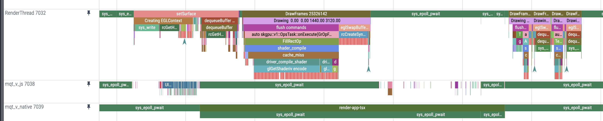

In the previous post: [Perfetto To Analyze App Start Performance...](/posts/analyzing-app-start-android-systrace/), we
went over how to use Perfetto to visualize Systrace calls.

Now you might be wondering what else we can do with this? Below I'll cover how
you can use use Android's Trace API.

## Android's Trace API

```kotlin
import androidx.tracing.Trace
...
Trace.beginSection("section_name")
...// Your code block to be traced
Trace.endSection()
```

The above will show up in Perfetto as a trace event, allowing you to see how
long a specific section of your code takes to execute and correlate it with
other events in your app.

Use Trace for:

- Measuring UI performance (e.g., screen transitions)
- Tracking execution of specific blocks during startup
- Debugging jank or slow operations

The Trace API is not bridged by default in React Native. The internal [React
Native Systrace](https://github.com/facebook/react-native/blob/457190cc4b3a113d70431cbc06021d049c940180/packages/react-native/Libraries/Performance/Systrace.js#L125-L134) API is only available in DEV and isn't properly setup for open source.

So we are left with having to bridge this ourselves for our Android trace
analysis.

## Trace Native Module

_nit not using TurboModule on purpose for simplicity, [here is a post with this
module converted to TurboModule](/posts/migrating-native-module-to-turbo-module-android)_

In android/app/src/main/java/com/myrnapp/TracingModule.kt:

```kotlin
package com.myrnapp

import androidx.tracing.Trace
import com.facebook.react.bridge.ReactApplicationContext
import com.facebook.react.bridge.ReactContextBaseJavaModule
import com.facebook.react.bridge.ReactMethod

class TracingModule(reactContext: ReactApplicationContext) : ReactContextBaseJavaModule(reactContext) {

    override fun getName(): String {
        return "TracingModule"
    }

    @ReactMethod
    fun beginSection(sectionName: String) {
        Trace.beginSection(sectionName)
    }

    @ReactMethod
    fun endSection() {
        Trace.endSection()
    }
}
```

Create a new file: android/app/src/main/java/com/myrnapp/TracingPackage.kt:

```kotlin
package com.myrnapp

import com.facebook.react.ReactPackage
import com.facebook.react.bridge.NativeModule
import com.facebook.react.bridge.ReactApplicationContext
import com.facebook.react.uimanager.ViewManager

class TracingPackage : ReactPackage {

    override fun createNativeModules(reactContext: ReactApplicationContext): List<NativeModule> {
        return listOf(TracingModule(reactContext))
    }

    override fun createViewManagers(reactContext: ReactApplicationContext): List<ViewManager<*, *>> {
        return emptyList()
    }
}
```

In android/app/src/main/java/com/myrnapp/MainApplication.kt, inside getPackages():

```kotlin
override fun getPackages(): List<ReactPackage> =
    PackageList(this).packages.apply {
        // Add the tracing package manually
        add(TracingPackage())
    }
```

JS/TS usage:

```typescript
function beginTraceSection(title: string) {
	if (Platform.OS === "android") {
		NativeModules.TracingModule.beginSection(title);
	}
}

function endTraceSection() {
	if (Platform.OS === "android") {
		NativeModules.TracingModule.endSection();
	}
}

beginTraceSection("render-app-tsx");
/* in some View's onLayout you can do:

<View
  onLayout={() => {
    endTraceSection();
  }}

*/
```

Done, now you can correlate your trace calls with the rest of the traces.


