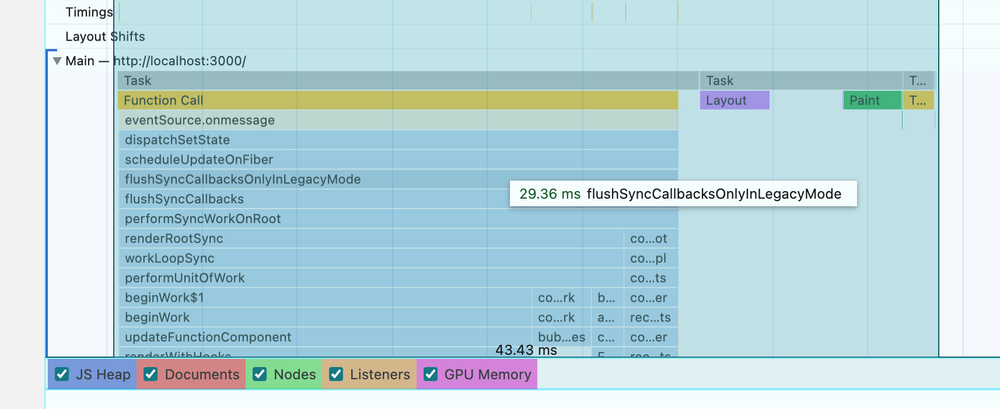
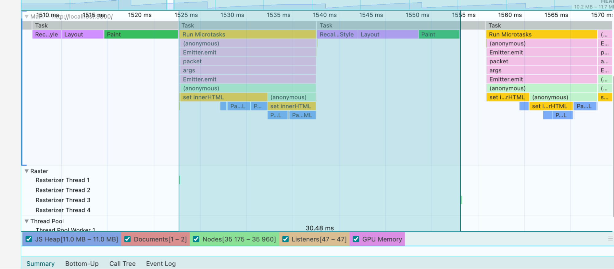
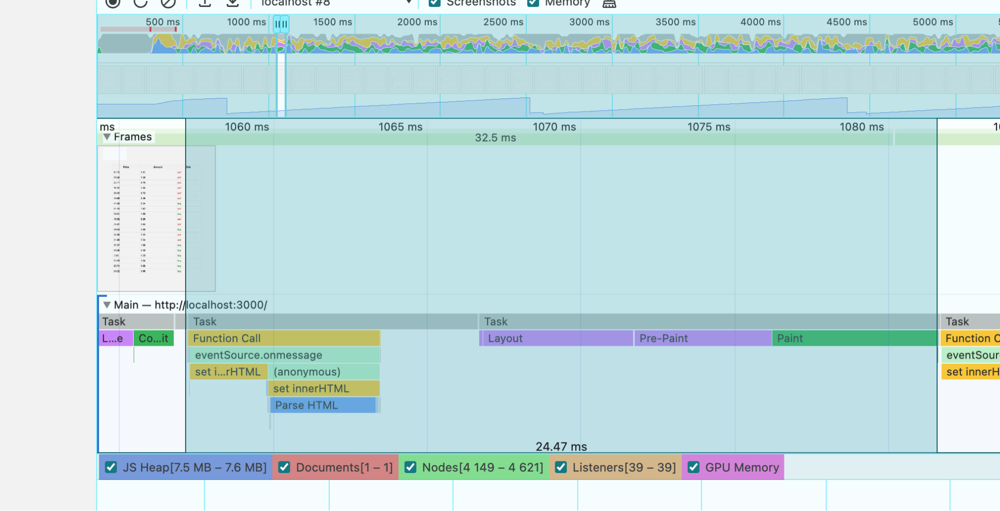
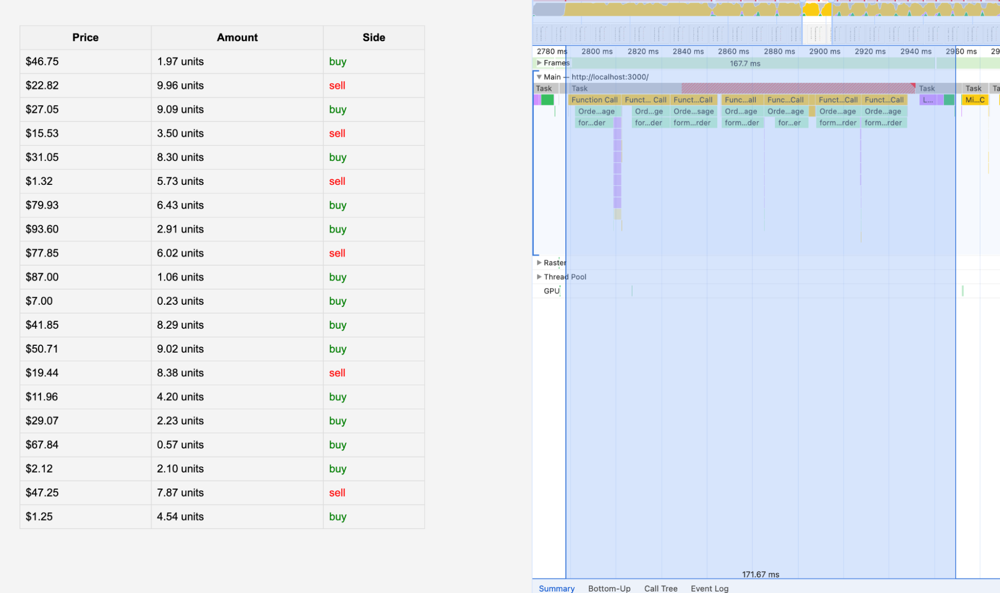

import image1 from './image1.mp4';
import image4 from './image4.mp4';
import image5 from './image5.mp4';
import image8 from './image8.mp4';

# Can HTML Render 40 Updates Per Second?

During an investigation to validate if a Canvas solutions was required to
achieve 40 updates per second. We tested the performance of HTML with vanilla JS
and Virtual DOM libraries like React, Inferno.js, and Solid.js when receiving
WebSockets and Server-Sent Events (SSE).

*Note, none of the above gifs are sped up.*

## Vanilla JS plus WebSockets

<video controls style={{ width: "100%", height: "auto" }}>
  <source src={image1} type="video/mp4"/>
  Your browser does not support the video tag.
</video>

5 seconds window doing 40 updates per second via websocket client spent 370 milliseconds rendering (loading \+ scripting \+ rendering \+ painting \+ system) and 5090 milliseconds in idle mode.

Now with 20x CPU slowdown. It can lag but still doing 40x updates per second.

## Vanilla JS plus SSE

WebSocket implementation took on average 30ms from *Event.emit* to Paint via innerHTML. There were some hiccups with clearing times out with WebSockets that we didn't observe with SSE.

<video controls style={{ width: "100%", height: "auto" }}>
  <source src={image4} type="video/mp4"/>
  Your browser does not support the video tag.
</video>

SSE implementation also has similar 24.47ms time from *onmessage* to Paint via innerHTML.

We also tested what would be the number of updates were we would start seeing significant lags and we arrived at 58 prices updates per second (interval of every 17ms). This is with 20x CPU slowdown:

<video alt="Vanilla JS 58 updates on 20x CPU slowdown" controls style={{ width: "100%", height: "auto" }}>
  <source src={image5} type="video/mp4"/>
  Your browser does not support the video tag.
</video>

58 prices updates per second at 20x CPU slowdown.

## React

React comes to a halt when throttled to 20x CPU with 40 updates per second, it just freezes.

React comes to a halt at 40 updates per second, at 10 updates per second it takes \~45ms to receive the message and fully paint, at 20x CPU slowdown.

We then tried with Inferno.js and we had the same problem as React.

Then we tried with Solid.js

<video alt="React with 20x CPU throttling" controls style={{ width: "100%", height: "auto" }}>
  <source src={image8} type="video/mp4"/>
  Your browser does not support the video tag.
</video>

It was able to handle 20x CPU throttling but with tons of hiccups and a massive 171ms update span from message to receive to paint.

## Conclusion

HTML is fast enough with vanilla JS. Our testing shows that it is capable of up to 58 updates per second in a 20x CPU slowdown using a 2023 Apple M2 Pro. However, any usage of libraries that require virtual DOMs don't scale. We tried Preact, React, Inferno.js, and Solid.js.

We also tried [Mikado](https://github.com/nextapps-de/mikado?tab=readme-ov-file\#get-started) and [Moon.js](https://github.com/kbrsh/moon) but ran into technical issues to have it properly run.

The React example can be further optimized plus we could use React 18 which is
supposed to handle CPU priority better. I'll explore this in a future post.

