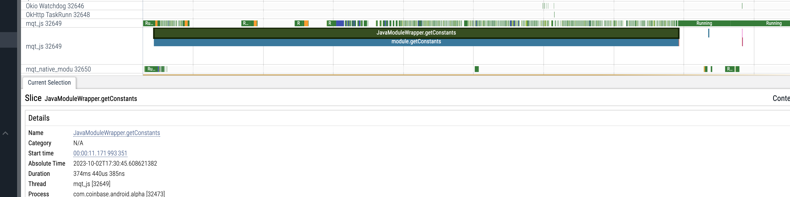

When you look at a piece of code like this in React Native you probably think to yourself,
harmless right?

```typescript
const { JailMonkey } = NativeModules;

```

> Well turns out no.


## Performance Is A Feature Not Given.

Unfortunately in the software industry performance is always a afterthought, and
this was no exception. I started working on analyzing app start performance after multiple
customer complaints on how slow the app was to start.

This is a difficult job to achieve since many things can affect app start
performance, so you need the right tools. Ideally we would shift this detection
left and catch it early during development but this is topic for another post.

On [previous posts](/posts/analyzing-app-start-android-systrace) I covered how you can use Perfetto Systrace on Android. This
tool helps you visualize where some of the performance issues are coming from.


## A Blocking getConstant Call

When I first ran the Perfetto Systrace and analyzed it in [ui.perfetto.dev](ui.perfetto.dev)
I immediately noticed a blocking call to `getConstant` in the JS thread.



The catch here is that if you are running a JavaScript profiler you won't see these
kinds of issues because they occur at module initialization which is typically
very early in the app process.

> TODO: I'll share a post soon on how I lazy load the app while profiling JS to
> ensure I capture the cost of module initialization.

I knew getConstant calls were related to Native Module initializations because I
have read the React Native source code lol. So I
narrowed down the places to look and quickly found the culprit code:

```typescript
const { JailMonkey } = NativeModules;

```

## But Why is Jail Monkey Blocking?

What is going on inside this getConstant call?

For those that don't know jail-monkey is a library to check if the device is
rooted or jailbroken. While we can't do anything about this, we use this
information to warn users that they are not safe on these types of phones.

So we added jail-broken check to do that kind of warning. However, this library
[naively does the root check at module initialization](https://github.com/GantMan/jail-monkey/blob/3ca2b4e5d7d18e031210b8d101a8915612d26312/android/src/main/java/com/gantix/JailMonkey/JailMonkeyModule.java#L72). This would be fine if this
was async on a separate native module thread, however, in the old architecture,
the only synchronous JS blocking call that existed was actually the getConstant
call for when you initialize your module since that is how you set the methods
and variables available in the module in the JS thread.


1. [RootedCheck getConstant call](https://github.com/GantMan/jail-monkey/blob/3ca2b4e5d7d18e031210b8d101a8915612d26312/android/src/main/java/com/gantix/JailMonkey/JailMonkeyModule.java#L72)
2. [RootedCheck constructor](https://github.com/GantMan/jail-monkey/blob/3ca2b4e5d7d18e031210b8d101a8915612d26312/android/src/main/java/com/gantix/JailMonkey/Rooted/RootedCheck.java#L52-L65)


Well, turns out this root check costs about 300ms on a typical Android device
and fully blocks the JS thread contributing to a higher cold start.

## How Did We Solve It?

Well, we made what was sync into an async all.

Making the module fully support async call would require a large rewrite, so
instead we patched the code to remove the synchronous blocking behavior and we
moved the check we needed into an async callback call. This way we can still get
the validation back but in a mannger that doesn't block the JS thread from
running.

Here is the patch case you are interested:

```diff
diff --git a/android/src/main/java/com/gantix/JailMonkey/JailMonkeyModule.java b/android/src/main/java/com/gantix/JailMonkey/JailMonkeyModule.java
index 018d7051a57a2250c738e018ba8e1518d1b9525a..8c96318dd1d6e4bc390f6e38a1fc44de6ba24974 100644
--- a/android/src/main/java/com/gantix/JailMonkey/JailMonkeyModule.java
+++ b/android/src/main/java/com/gantix/JailMonkey/JailMonkeyModule.java
@@ -15,6 +15,8 @@ import com.gantix.JailMonkey.Rooted.RootedCheck;

 import java.util.HashMap;
 import java.util.Map;
+import java.util.concurrent.Executor;
+import java.util.concurrent.Executors;

 import javax.annotation.Nullable;

@@ -64,21 +66,43 @@ public class JailMonkeyModule extends ReactContextBaseJavaModule {
         p.resolve(isDebuggedMode);
     }

+    @ReactMethod
+    public void isJailBrokenAsync(Promise promise) {
+      // We want to run this on a separate thread to not block the Native Module
+      // thread.
+      Executor executor = Executors.newSingleThreadExecutor();
+      executor.execute(new Runnable() {
+          @Override
+          public void run() {
+              try {
+                final RootedCheck rootedCheck = new RootedCheck(getReactApplicationContext());
+                promise.resolve(rootedCheck.isJailBroken());
+              } catch (Exception e) {
+                promise.reject("ROOT_CHECK_ERROR", "Error checking root status", e);
+              }
+          }
+      });
+    }
+

     @Override
     public @Nullable
     Map<String, Object> getConstants() {
         ReactContext context = getReactApplicationContext();
-        final RootedCheck rootedCheck = new RootedCheck(context);
-
         final Map<String, Object> constants = new HashMap<>();
-
-        constants.put("isJailBroken", rootedCheck.isJailBroken());
-        constants.put("rootedDetectionMethods", rootedCheck.getResultByDetectionMethod());
-        constants.put("hookDetected", hookDetected(context));
-        constants.put("canMockLocation", isMockLocationOn(context));
-        constants.put("isOnExternalStorage", isOnExternalStorage(context));
-        constants.put("AdbEnabled", AdbEnabled(context));
+        /*
+         * The new RootedCheck() is very expensive on Android and blocks the JS
+         * thread for 400ms in production. We currently only care of
+         * isJailBroken which I made a async version. We will try to migrate all
+         * these calls to async versions that run on separate threads upstream.
+         * */
+        // constants.put("isJailBroken", rootedCheck.isJailBroken());
+        // constants.put("rootedDetectionMethods", rootedCheck.getResultByDetectionMethod());
+        // constants.put("hookDetected", hookDetected(context));
+        // constants.put("canMockLocation", isMockLocationOn(context));
+        // constants.put("isOnExternalStorage", isOnExternalStorage(context));
+        // constants.put("AdbEnabled", AdbEnabled(context));
         return constants;
     }
 }
+
diff --git a/jailmonkey.d.ts b/jailmonkey.d.ts
index af0362976f76d5ca93f2b1c111567887d7c9b840..5665abef3bc5a28ae119192429baa1c926c978d9 100644
--- a/jailmonkey.d.ts
+++ b/jailmonkey.d.ts
@@ -4,6 +4,7 @@
 declare const _default: {
   jailBrokenMessage : () => string,
   isJailBroken: () => boolean;
+  isJailBrokenAsync: () => Promise<boolean>;
   androidRootedDetectionMethods?: {
     rootBeer: {
       detectRootManagementApps: boolean;
diff --git a/jailmonkey.js b/jailmonkey.js
index 2af5681a6910b1af4fd09718acae7f89ec46fd36..d8e114221cdc23e2934b2a106fe354d798974f2b 100644
--- a/jailmonkey.js
+++ b/jailmonkey.js
@@ -7,6 +7,7 @@ if (JailMonkey == null) console.warn("JailMonkey is not available, check your na
 export default {
   jailBrokenMessage: () => JailMonkey.jailBrokenMessage || "",
   isJailBroken: () => JailMonkey.isJailBroken || false,
+  isJailBrokenAsync: () => JailMonkey.isJailBrokenAsync() || Promise.resolve(false),
   androidRootedDetectionMethods: JailMonkey.rootedDetectionMethods,
   hookDetected: () => JailMonkey.hookDetected || false,
   canMockLocation: () => JailMonkey.canMockLocation || false,
```

