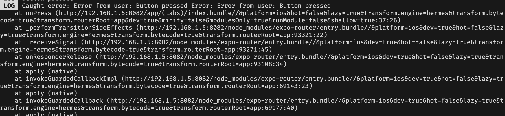

At work our team has been tracking error rates in our app by having a separate
Bugsnag project for errors shown to user. These errors are typically caught by
error boundaries or try/catch blocks. Surprisingly, we recently noticed we were
not catching errors within callbacks.

Errors within callbacks are not caught by error boundaries. Naturally we think
that we will catch them through try-catches, but that's not the case.
Try-catches are often only reached for in asyncronous code, we don't have a
tendency of writing try-catch blocks for synchronous code.

Thus we need a way to catch these uncaught errors globally. This resulted
in this quick reaseach on how to listen to uncaught/unhandled errors in React
Native (this works for pure React as well).

## How to listen to uncaught/unhandled errors in React Native


If an error is thrown in a callback as follows:
```jsx
<Button title="Press me" onPress={() => {
    console.log('Button pressed')
    throw new Error('Error from user: Button pressed')
  }}
/>
```


We can catch it via the setGlobalHandler:

```typescript
globalThis.ErrorUtils.setGlobalHandler(function (thrownValue: unknown, isFatal: boolean) {
	if (thrownValue instanceof Error) {
		console.log("Caught error:", thrownValue.message, thrownValue.stack);
	}
});
```
Since `thrownValue` can be anything be careful and check its type.



Since we are reaching into the global object, in React Native we need to
declare the type definition of ErrorUtils:

In your global.d.ts extend the `global` object:

```typescript
export declare global {
	var ErrorUtils: {
		setGlobalHandler: (callback: (error: unknown, isFatal: boolean) => void) => void;
		getGlobalHandler: () => (error: unknown, isFatal: boolean) => void;
	};
}
```

In your tsconfig add the global.d.ts file to the include key:

_latest expo app tsconfig will look like this:_

```json
  "include": [
    "**/*.ts",
    "**/*.tsx",
    ".expo/types/**/*.ts",
    "expo-env.d.ts",
    "./global.d.ts",
  ]
```
