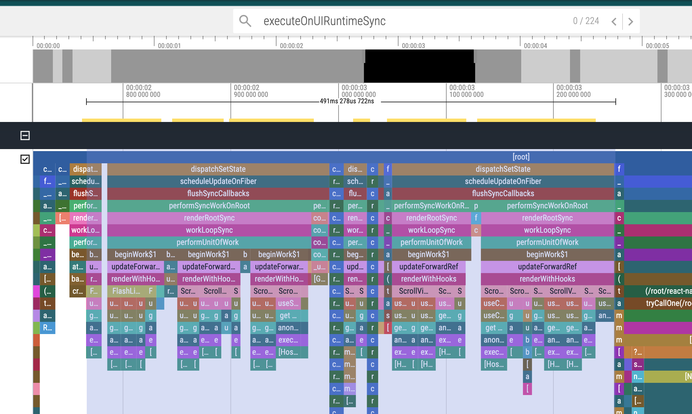

import flamegraphImage from './cpu-profile-of-collapsible-tab-view.png';

[Reanimated, the React Native animation
library](https://docs.swmansion.com/react-native-reanimated/) allows you to run
animations on the UI thread. This is its main selling point and the reason
behind its performance.

When you run animations on the UI thread they are smoother and more performant
specially when you handle the gestures in that same thread with [React Native Gesture
Handler](https://docs.swmansion.com/react-native-gesture-handler/docs/).

The problem is Reanimated introduces a new concept of ["Worklets"](https://docs.swmansion.com/react-native-reanimated/docs/fundamentals/glossary#worklet) and [Shared
Values](https://docs.swmansion.com/react-native-reanimated/docs/fundamentals/glossary#shared-value). Developers don't alway know if a value should be a Shared Value or not.
Thus some decide to just use a Shared Value everywhere. This article covers the
consequences of this approach when you need to read the Shared Value from the
JavaScript thread.

## How Did I Get Here?

In an attempt to use
[react-native-collapsible-tab-view](https://github.com/PedroBern/react-native-collapsible-tab-view)
to solve a common UI pattern in one of the apps I work we noticed this
performance issue below:

The flame graph above shows that the JavaScript thread is blocked by **executeOnUIRuntimeSync**
for quite some time impacting the initial render time of a screen by over 500ms.

