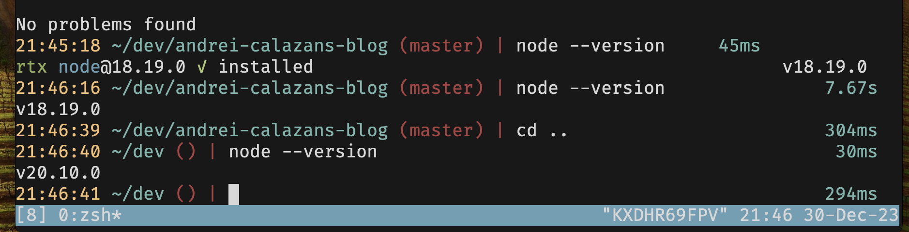

I think [rtx](https://github.com/jdx/rtx) nails the developer experience with
managing runtime versions and you likely have not heard of it yet.

This screenshot alone has a few strong reasons why you should be using rtx:

1. With Node, rtx interops already with .nvmrc files.
2. You don't have to preinstall Node, when you switch into a project that has a different Node version and you run a Node command rtx will do the job of installing that version for you.
3. Switching out of the directory will change the version back to your default.
4. It's super fast. Nvm would not have taken 7 seconds to install Node 18.19.0
5. All of the above is true for Ruby, Java, Python, Bun, Deno, Go, and possibly
   more as people start using it?

Now if you like me, working with React Native and needing to manage runtime dependencies for Java, Node, Python, and Ruby. rtx is exactly what we want.

And it seems like more is to come since Jesff Dickey ([@jdxcode](https://twitter.com/jdxcode)) announced support for [task runners in rtx as well](https://github.com/jdx/rtx/discussions/1264).

Oh did I also mention it's written is Rust? so it is Blazingly Fast 😍
